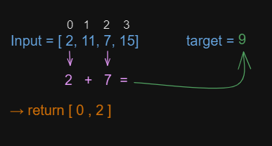

# Two sum

Given an array of integers ` nums ` and an integer ` target `, return indices of the two numbers such that they add up to ` target `.

You may assume that each input would have **exactly one solution**, and you may not use the same element twice.

You can return the answer in any order.

**Example 1:**

```text
Input: nums = [2,7,11,15], target = 9
Output: [0,1]
Explanation: Because nums[0] + nums[1] == 9, we return [0, 1].
```

**Example 2:**

```text
Input: nums = [3,2,4], target = 6
Output: [1,2]
```

**Example 3:**

```text
Input: nums = [3,3], target = 6
Output: [0,1]
```

---

## Solution

the ` twoSum ` function takes an array ` nums ` and a ` target ` value as **input**, and **returns an array** with the indices of the two numbers whose sum is equal to the value of ` target `.



### How it Works?

The function creates an empty `Map` object and iterates through the `nums` array using a `for` loop. In each iteration of the loop, the function calculates the complement of the current number (i.e., the difference between **target** and **the current number**) and checks if the complement exists in the `Map` object.

If the complement already exists in the `Map` object, the function returns an array with the indices of the complement and the current number.

If the complement does not exist in the `Map` object, the function saves the current number and its index in the `Map` object for later use.

If the function does not find a pair of numbers whose sum is equal to the value `of target`, it returns an empty array.

**Example Usage:**

```js
const nums = [2, 7, 11, 15];
const target = 9;
const result = twoSum(nums, target);
console.log(result); // [0, 1]
```

In this example, the nums array contains the numbers [2, 7, 11, 15] and the target value is 9. The twoSum function returns [0, 1], which are the indices of the numbers 2 and 7, since 2 + 7 = 9.

---
**Run Test** `npm test two-sum.test.js`

[LeetCode](https://leetcode.com/problems/two-sum/)
